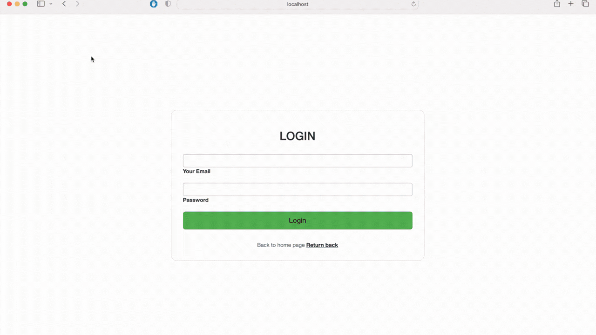

# Spring web  travel agency project.

Worked on creating a web application for a travel agency. The main requirements for the project were the use of Maven, Hibernate, Spring MVC (JSP + JSTL), Spring Security technologies, but without Spring Boot.
Our program should have the following functionality:
- Two roles (User and Manager) that have different access rights. User can search for hotels by country, check the availability of free rooms, and make hotel reservations for the relevant dates.
  Manager has the same functionality as in User. It can also add new hotels and rooms. Manager can see all Users and view their orders.
- We should have at least three pages Login, Home page, Management.

The MySQL database was used in the project. Spring Security Authority was implemented by granting certain rights to the corresponding role. When encoding passwords, BCryptPasswordEncoder is used. For convenience, two DataSources have been created, one with a thread pool setting for the application and another for the developer without a thread pool.

By scrolling to the bottom, you can see what the visual implementation of all requirements looks like. The following functionality was also added:
- the possibility for the user to view all his orders and adjust them;
- the manager deletes and updates data about the hotel and its rooms;
- the manager can delete users or ban them;
- registration function;

## The login-logout page. After authorization, we can view all our orders.

## After registration, we can go through authorization in our system by email.

## The home page on which we can search for hotels and check the availability of available rooms.

## Reservations can be made after authorization.

## The manager page where we can see all our hotels, rooms, users and their orders.

## We are adding new hotels. We have a check of the correctness of filling in the fields.

## We look at the contents of a room in a specific hotel.

## We are adding a new room to the hotel we need.

## We are updating the data about the room.

## The manager can manage users and view their orders.

